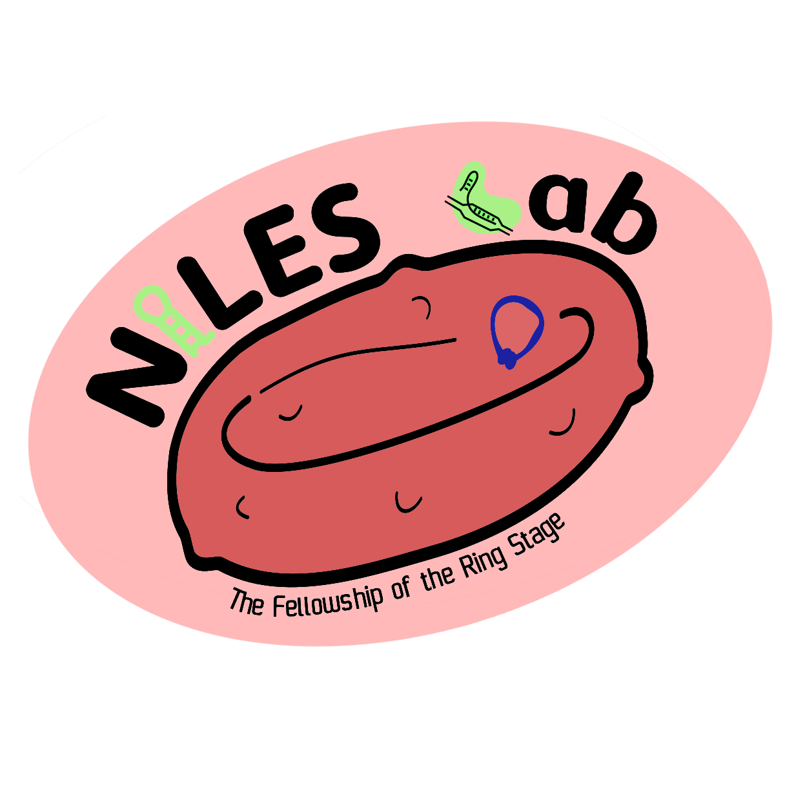

# GeneTargeter 

GeneTargeter creates custom gene-editing constructs designed for knock-out or conditional knock-down in [_Plasmodium falciparum_](http://www.who.int/mediacentre/factsheets/fs094/en/). It is developed by the [Niles Lab at MIT](http://web.mit.edu/nileslab/) and [described in detail in this article](https://www.liebertpub.com/doi/epdf/10.1089/crispr.2021.0069).

At the Niles Lab, GeneTargeter is used to deliver 3' or 5' UTR post-transcriptional regulatory element payload to a specific given gene ([Ganesan et al., 2016](https://dx.doi.org/10.1038%2Fncomms10727), [Nasamu et al., 2021](https://doi.org/10.1038/s41598-020-77644-4)). However, user-defined custom plasmids can be used as well.

Most applications can be served well through the web application running at [genetargeter.mit.edu](genetargeter.mit.edu) .

NOTE: the app sometimes takes a good 30 seconds to load if nobody's used it in a while.

___

However, if you really want to run it locally, you can do so as follows:

## Installation

You will need a [Python 3](https://www.python.org/downloads/release/python-2716/) distribution (>3.7 recommended) to run GeneTargeter locally. Consider using [Virtualenv](https://virtualenv.pypa.io) to set up a Python environment. To install Virtualenv using [Pip](https://pip.pypa.io) and create a virtual environment to run GeneTargeter in, use

```bash
virtualenv venv
source venv/bin/activate
```

You can exit the virtual environment when you're done using GeneTargeter with
```bash
deactivate
```

To install GeneTargeter, make sure you are running Python 3 in your local virtual environment. Then, clone the repo and run setup from within the main directory:

```bash
git clone git://github.com/pablocarderam/genetargeter.git
cd GeneTargeter
python setup.py install
```

## Usage

To run GeneTargeter as a command line application, use the following command:

```bash
genetargeter PATH/TO/FILE.gb ParameterFile.txt PATH/TO/OUTPUTFOLDER NAME_OF_GENE
```

The last parameter is optional; if empty, the name will be taken from the name of the file. Additionally, instead of the name of a single file, a directory may be listed. In this case, all files in the folder will be processed and each gene's name will be taken from the name of its file. The command would look as follows:

```bash
genetargeter PATH/TO/INPUT_FOLDER ParameterFile.txt PATH/TO/OUTPUT_FOLDER
```

Parameters may be specified within ParameterFile.txt--see the examples provided in the code.

## Output
For every possible mRNA transcript within the gene uploaded, GeneTargeter outputs:

- a **GenBank file** containing the given gene annotated with the chosen left and right homologous regions, before chromosomal editing.
- a **GenBank file** containing the fully annotated plasmid vector designed to target the given gene.
- a **GenBank file** containing the edited chromosomal locus targeted by the construct.
- a **CSV file** containing primers and oligos designed to assemble the new plasmid using Gibson Assembly. This file can be imported into Benchling. Abbreviates primer names to fit on commercial tube labels with the format:
```Seven Digit Gene Identifier_Oligo type_Orientation```
- a **FASTA file** containing gene fragments with overlaps designed to assemble the new plasmid using Gibson Assembly.
- a **CSV file** comparing different possible sgRNAs evaluated by GeneTargeter before making a choice according to a variety of scoring metrics, as well as the corresponding recoded sgRNA for each in the final design.
- a **text file** containing a message log and warnings issued during the _in silico_ design process, along with plasmid assembly instructions.

Alternatively, you may choose to consolidate the files of all transcripts being processed into a single file for each type, using the bulk file option.
You may also add an (optionally numbered) prefix to all file, GenBank, oligo, and gene fragment names, to use in your own records.

## Contributing
Pull requests are welcome, but we'd really appreciate your feedback about it! Please contact [pablocarderam at gmail dot com](pablocarderam@gmail.com) and open an issue first to discuss what you would like to change.

## Acknowledgements
This project has been possible thanks to the invaluable help of many others, particularly Drs. Jacquin Niles, Sumanta Dey, and Lisl Escherick.

On-target Cas9 gRNA scoring code obtained from [Miles C. Smith's Python 3 port](https://github.com/milescsmith/Azimuth) of [Microsoft Research's Azimuth scoring algorithm](https://github.com/MicrosoftResearch/Azimuth/) developed from the Rule set 2 algorithm presented by [Doench et al. (2016)](https://dx.doi.org/10.1038/nbt.3437). The off-target Cas9 CFD scoring matrix was also from the [Doench et al. (2016)](https://dx.doi.org/10.1038/nbt.3437) supplementary material.

On-target Cas12 gRNA scoring coefficients obtained from [Kim et al. (2017)](https://dx.doi.org/10.1038/nmeth.4104) supplementary material, equivalent to the [CINDEL](http://big.hanyang.ac.kr/cindel/) online tool. Exact on-target scores may vary between GeneTargeter and [CINDEL](http://big.hanyang.ac.kr/cindel/) due to minor differenes in gRNA free energy calculations.

Self-folding Gibbs free energy of gRNAs (used to calculate [Kim et al. (2017)](https://dx.doi.org/10.1038/nmeth.4104) [CINDEL](http://big.hanyang.ac.kr/cindel/) scores) calculated using RNAfold obtained from [ViennaRNA v2.3.3](http://www.tbi.univie.ac.at/RNA/index.html) [(Lorenz et al., 2011)](https://dx.doi.org/10.1186/1748-7188-6-26).

Off-target Zhang Lab scoring matrix obtained December 27, 2016 from the online [MIT CRISPR tool](http://crispr.mit.edu/about) [(Hsu et al., 2016)](https://dx.doi.org/10.1038/nbt.2647).

Off-target gRNA database built from the _P. falciparum_ genome first published by [ Gardner et al. (2002)](https://dx.doi.org/10.1038/nature01097) and subsequently edited by the [PlasmoDB](http://plasmodb.org/plasmo/) community.

Codon frequency tables obtained from the [High-performance Integrated Virtual Environment-Codon Usage Tables (HIVE-CUT) database](https://hive.biochemistry.gwu.edu/cuts/about) [(Athey et al., 2017)](https://dx.doi.org/10.1186/s12859-017-1793-7).

Niles Lab logo made by Gaël Chambonnier.


## Authors

I'm Pablo Cárdenas, a member of the [Niles Lab](http://web.mit.edu/nileslab/) at [MIT Biological Engineering](be.mit.edu). Follow my science antics at [@pcr_guy on Twitter](https://twitter.com/pcr_guy).

## License
Well [MIT](https://choosealicense.com/licenses/mit/), of course!
